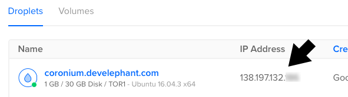

__Coronium Core__ runs best on a __[DigitalOcean](https://m.do.co/c/cddeeddbbdb8) Ubuntu 16.04__ droplet.

!!! tip "Free Hosting Credit"
    If you're new to [DigitalOcean](https://m.do.co/c/cddeeddbbdb8) please consider signing up with __[this link](https://m.do.co/c/cddeeddbbdb8)__. Not only will you receive a $10 credit (2 free months), but it also helps support the continued development, and testing of __Coronium Core__.

### Create A Droplet

Once you log into your [DigitalOcean](https://m.do.co/c/cddeeddbbdb8) account, click the __Create__ button and select __Droplets__ from the menu.


On the next screen, first select a __Ubuntu 16.04__ droplet distribution.

 

Select the droplet size. A __1 GB/1 CPU__ droplet is recommended as a minimum. If you're only testing, you can use a 512 MB droplet and increase the size later.


Next, select a region for the droplet. Consider choosing a location closest to your most active user base.


Select your SSH profile to attach to the droplet.


!!! caution ""
    There is an option where you can use a password instead of an SSH key, which may be easier if you're only testing __Coronium Core__, though I wouldn't recommend it. You can learn more about generating SSH keys for [DigitalOcean](https://m.do.co/c/cddeeddbbdb8) here: [Creating SSH Keys](https://www.digitalocean.com/community/tutorials/how-to-use-ssh-keys-with-digitalocean-droplets).

Now give your droplet a hostname.


_Be sure to replace __coronium.develephant.com__ with your own hostname._

And finally, click the __Create__ button to spin up the droplet.


### Install Coronium Core

Once your droplet is done spinning up, note the ip address.



Using a terminal/shell of your choice, SSH into the droplet.

!!! tip
    You can use the built in terminal on OSX. For Windows, check out __[PuTTY](https://www.chiark.greenend.org.uk/~sgtatham/putty/latest.html)__.

```
ssh root@<your-instance-ip>
```

_Replace __<your-instance-ip\>__ with the address that was assigned to your droplet._

Once you are connected to the droplet, copy and paste the following line into the terminal:

`wget https://s3.amazonaws.com/coronium-core/do/up.sh && sudo bash up.sh`

### Database Selection

At the start of the installation you will be prompted to choose the databases to install with your __Coronium Core__ server. You can select both __MySQL__ and __Mongo__ databases, or if you are only planning on using one kind, then select accordingly.

!!! tip ""
    You can conserve server memory by using only one database type.

!!! failure "Important"
    __You must select at least one database type or the installation will fail.__ Choose wisely, you cannot install an additional database after the the selection process has completed.

### Database Passwords

Once the installation is complete, you will be prompted for your choice of database passwords. Make sure they are secure, and don't lose them. You will use these passwords to connect to your databases both internally and externally.

Once the installation is complete, take a look at the __[Post Install](/server-install/postinstall/)__ section.