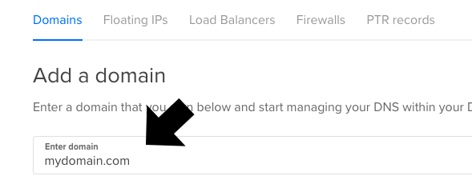

Secure your __Coronium Core__ server by utilizing the free SSL certificate service __[Let's Encrypt](https://letsencrypt.org/)__.

!!! warning
    Setting up a secure Coronium Core server is not a trivial process, so be sure to read through _all_ of the steps before starting, and then follow them carefully.

!!! note "Screencast"
    View the secure install instructions in a screencast format by [clicking here](https://youtu.be/8WyWMkVLQWw).

## Overview

To be issued a secure certificate, you must have a fully qualified domain name, and the proper DNS set up to serve the domain.

A fully qualified domain name is basically a registered domain name. Where you decide to purchase a domain is up to you. __[GoDaddy](https://www.godaddy.com/)__ is a popular choice. 

Once you have your domain name, you will need to "point" it to your Coronium Core server. Most domain registars provide a means of setting up DNS.

You will want to set up a 3rd level domain for your Coronium Core server. This looks something like:

__coronium.<mydomain\>.com__

## Amazon

When you first install Coronium Core, make sure to [add the proper ports](/server-install/ec2/#create-an-instance) to security group settings. You can then use the [Route 53](https://console.aws.amazon.com/route53/home) service for your DNS. There are ample guides to assist you. 

Once set up, proceed to the [Let's Encrypt](#lets-encrypt) section below.

## DigitalOcean

You will need to point your domain to the DigitalOcean nameservers. The process for this varies by domain registar, but in all cases, you will need the DigitalOcean nameserver addresses, which are:

  - ns1.digitalocean.com
  - ns2.digitalocean.com
  - ns3.digitalocean.com

_Instructions for setting nameservers on GoDaddy can be found [here](https://www.godaddy.com/help/set-custom-nameservers-for-domains-registered-with-godaddy-12317)._

!!! warning "Important"
    __Spin up a Coronium Core droplet as outlined in the [DigitalOcean Installation](/server-install/digitalocean/) section before continuing.__

1\. In the DigitalOcean control panel, click the __Networking__ link at the top:


2\. Enter your new domain name, without any prefix:



3\. Click the __Add Domain__ button:


4\. On the next screen, do the following:

 - Enter the hostname (only the domain prefix) of your Coronium Core server. (1)
 - From the __WILL DIRECT TO__ field, select your Coronium Core droplet. (2)


5\. Click the __Create Record__ button on the right:


At this point your DNS is set up, but generally needs to propagate. This can take anywhere from 5 minutes to a number of hours (though usually within 15 minutes). 

You can check the progress using a site like [whatsmydns](https://www.whatsmydns.net/#A/). Enter the full domain, including the prefix, to test.

## Let's Encrypt

!!! Danger
    ___Do not continue with this guide until you have an active domain name for your Coronium Core server that you can reach through your web browser.___

To move your Coronium Core server over to HTTPS, perform the following steps:

1\. Log into your Coronium Core droplet using the __root__ user:

```sh
ssh root@<your-coronium-domain>
```

_Note: The root user is __ubuntu__ if hosting on Amazon._

If you have not changed the password yet, the default is __cloudadmin__. You may be prompted for your password at various times during this process.

2\. Copy and paste the following on the command line to run the Coronium Core SSL updater:

!!! warning
    At this point make sure you're ready to move over to HTTPS. The following process will permanently modify your configuration settings.

```
wget https://s3.amazonaws.com/coronium-core/ssl.sh && sudo bash ./ssl.sh
```

The script will install the needed components, and update the configuration files. 

You will then be propted for the _hostname_, a _fully qualified domain name_, and a valid _email_. These items are required to request a certificate from Let's Encrypt.

As stated earlier, you should have created a 3rd level domain, for example: __coronium.<domain\>.com__. Using the example, when entering the requested information, it might look like:

!!! note
    Make sure to hit the _delete_ key a few times before entering values. If the update returns a confirmation instantly, then a space in the data is the most likely reason. If this happens, start again at step 2 above.

_Enter a hostname:_ __coronium__

_Enter a FQDN:_ __coronium.<domain\>.com__

_Enter an email:_ __you@your-email.com__

Be sure to replace the information with your own answers.

!!! warning
    Make sure to triple check your information. If not, then you might not be issued a certificate.

After receiving your secure certificate, the script will exit and your Coronium Core server will be accesible using __https__. 

!!! tip
    It's generally a good idea to reboot the server instance by entering __sudo reboot -h__ on the command line. Wait a minute, and then check to make sure the server is running again.

Be sure to update the __host__ in the client configuration (in the Corona project):

```lua
core:init({
  server = "https://<coronium-core-host>"
  ...
})
```
